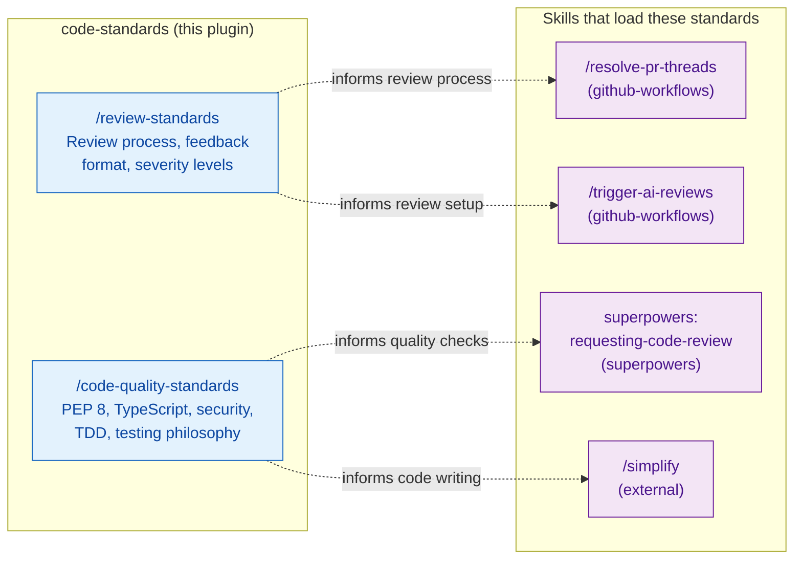

# code-standards — Architecture

Passive knowledge plugin providing code quality and review standards. These skills are
loaded on demand — they do not run automatically like hooks.

## Integration Map

## Passive vs Active

Standards plugins provide context when loaded — they do not block, intercept, or
modify operations. For active enforcement of coding patterns, see
[git-guards/ARCHITECTURE.md](../git-guards/ARCHITECTURE.md) and
[content-guards/ARCHITECTURE.md](../content-guards/ARCHITECTURE.md).
