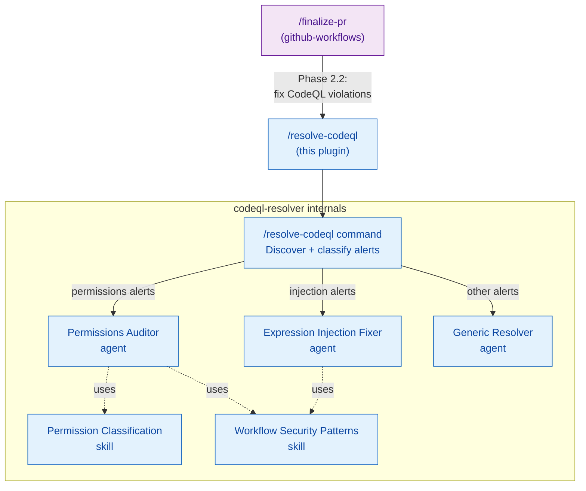
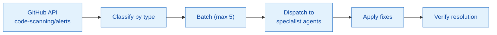

# codeql-resolver — Architecture

Cross-plugin integration view for CodeQL alert resolution. For internal architecture
(command, agents, skills), see [README.md](README.md).

## Integration with the Ship Pipeline

## Data Flow

## Cross-References

- [github-workflows/ARCHITECTURE.md](../github-workflows/ARCHITECTURE.md) — master
  pipeline showing `/finalize-pr` Phase 2.2 invocation
- [README.md](README.md) — internal 3-tier architecture details
