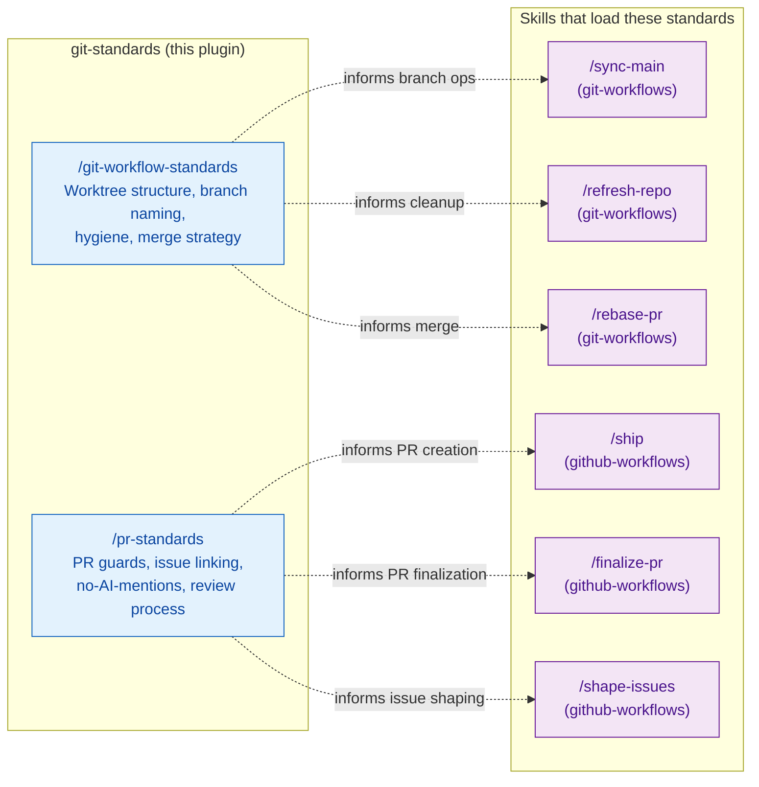

# git-standards — Architecture

Passive knowledge plugin providing git workflow conventions and PR standards. Loaded on
demand — for active enforcement, see
[git-guards/ARCHITECTURE.md](../git-guards/ARCHITECTURE.md).

## Integration Map

## Standards vs Enforcement

| Dimension | git-standards (this plugin) | git-guards |
|-----------|---------------------------|-----------|
| Activation | On demand | Automatic — every operation |
| Mechanism | Skill text injected into context | Hook exit codes (0/2) |
| Effect | Soft guidance and conventions | Hard block or reminder |
| Scope | Planning and workflow decisions | Runtime tool calls |
